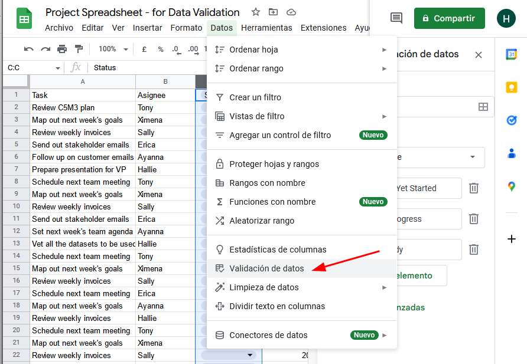
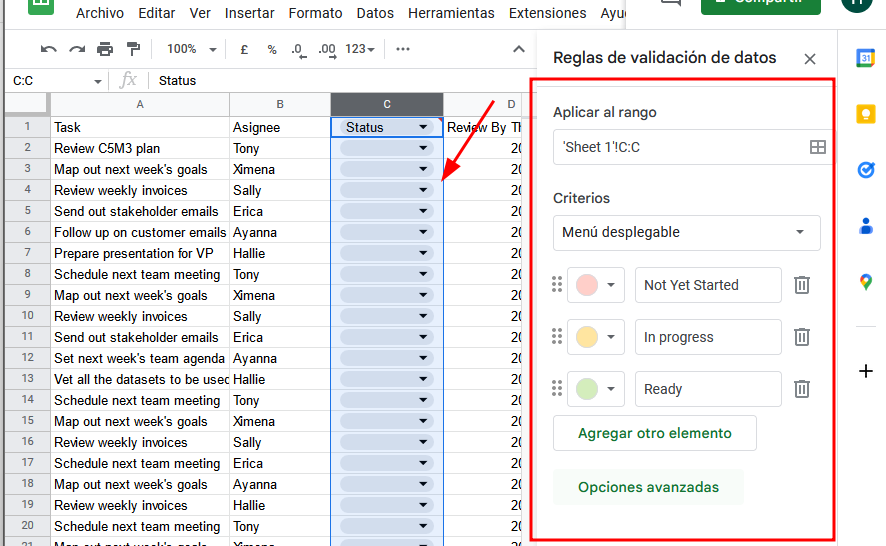
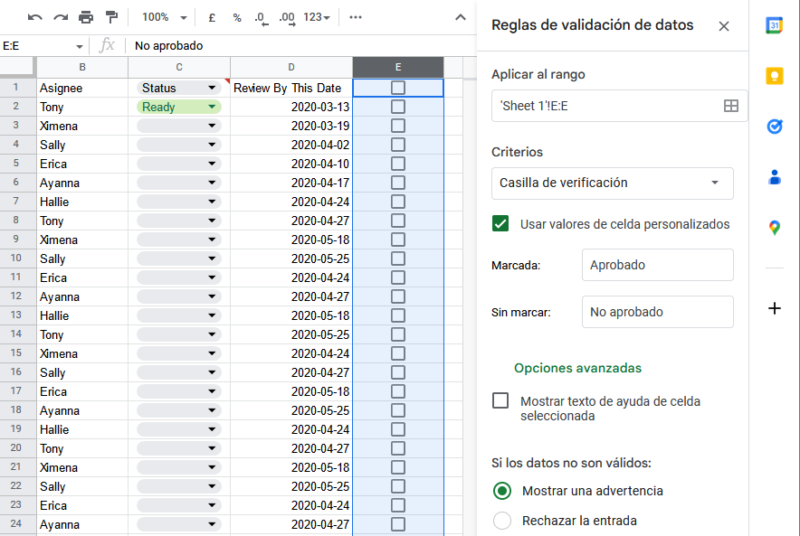

# Analyze

The process used to make sense of the data collected

## Goal

The goal of analysis is to identify trends and relationships within data so you can accurately answer the question you are asking

## Phases

The 4 phases of analysis:

1. Organize data
2. Format and adjust data
3. Get input from others
4. Transform data

### Sorting

When you arrange data into a meaningful order to make it easier to understand, analyze, and visualize

### Filtering

Showing only the data that meets a specific criteria while hiding the rest

---

## Ejercicio Practico SQL

Los meteorólogos con los que trabajas te han pedido que obtengas la temperatura, la velocidad del viento y las precipitaciones para las estaciones de La Guardia y JFK, en cada día de 2020, por orden descendiente de fecha y por orden ascendente de ID de Estación. 

```SQL
SELECT stn, date,
-- Usa la función IF para reemplazar los valores 9999.9, que la descripción del conjunto de datos explica que es el valor predeterminado cuando falta la temperatura, por NULLs en su lugar. 
IF(temp=9999.9, NULL, temp) AS temperature,

-- Usa la función IF para reemplazar los valores 999.9, que la descripción del conjunto de datos explica que es el valor predeterminado cuando falta la temperatura, por NULLs en su lugar. 
IF(wdsp="999.9", NULL, CAST(wdsp AS Float64)) AS wind_speed,

-- Usa la función IF para reemplazar los valores 99.99, que la descripción del conjunto de datos explica que es el valor predeterminado cuando falta la temperatura, por NULLs en su lugar. 
IF( prcp=99.99, 0, prcp) AS precipitation 

FROM `bigquery-public-data.noaa_gsod.gsod2020` 

WHERE stn="725030" -- La Guardia
  OR stn="744860" -- JFK 

ORDER BY 
  date DESC, 
  stn ASC
```

---

Los meteorólogos también te hicieron algunas preguntas cuando se preparaban para el noticiero de la noche: Quieren la temperatura promedio en junio de 2020 y la velocidad promedio del viento en diciembre de 2020.

```sql
SELECT

AVG(temperature)

FROM

`formulas-proyecto.weather_data.nyc_weather` 

--recuerda cambiar el nombre del proyecto a tu proyecto, antes de ejecutar esta consulta

WHERE

date BETWEEN '2020-06-01' AND '2020-06-30'
```
---

## Data validation

Allows you to control what can and can't be entered in your worksheet.

1. Add dropdown lists with predetermined options
2. Create custom checkboxes
3. Protect structured data and formulas





