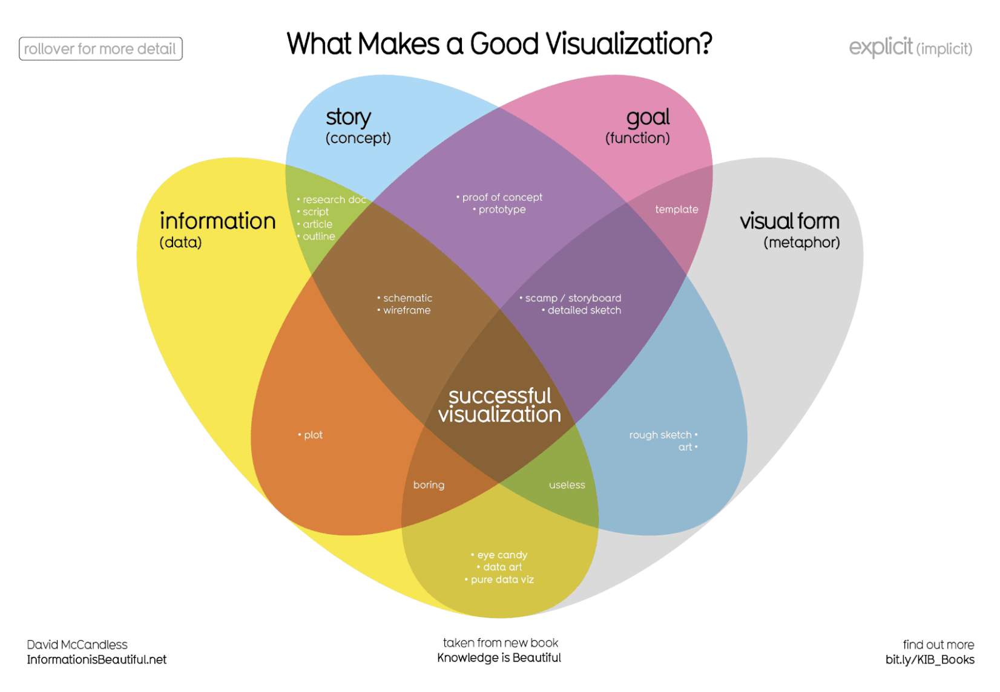

# Share

## Data Visualization

The graphic representation and presentation of data

`What makes a good visualization?`

El diagrama de Venn realizado por David McCandless identifica cuatro elementos de las visualizaciones exitosas:

1. Información (datos): La información o los datos que intentas transmitir son un componente clave de tu visualización de datos. Sin información ni datos, no puedes comunicar tus hallazgos con éxito.

2. Historia (concepto): La historia te permite compartir tus datos de maneras significativas e interesantes. Sin una historia, tu visualización es informativa, pero no realmente inspiradora.

3. Objetivo (función): El objetivo de tu visualización de datos hace que los datos sean útiles y utilizables. Esto es lo que intentas lograr con tu visualización. Sin un objetivo, tu visualización puede ser informativa de todos modos, pero no puede generar conclusiones viables.

4. Formato visual (metáfora): El elemento del formato visual es lo que le da estructura a tu visualización de datos y la hace bella. Sin formato visual, tus datos aún no se visualizan.

## Principios de diseño

Elige el elemento visual correcto.
	

    Una de las primeras cosas que tienes que decidir es qué elemento visual será el más eficaz para tu audiencia. A veces, una tabla simple es la mejor visualización. Otras veces, necesitas una visualización más compleja para ilustrar tu argumento.

Optimiza la proporción datos-trazo
	

    La proporción datos-trazo implica enfocarse en la parte del elemento visual que es esencial para comprender el sentido del gráfico. Intenta minimizar cuadros tipo trazo sin datos alrededor de leyendas o sombras para optimizar la proporción datos-trazo.

Utiliza la orientación de manera eficaz
	

    Asegúrate de que los componentes escritos del elemento visual, como las etiquetas en un gráfico de barras, sean fáciles de leer. Puedes modificar la orientación de tu elemento visual para hacer que sea más fácil de leer y comprender.

Color
	

    Hay muchas consideraciones importantes para tener en cuenta al pensar en usar color en tus elementos visuales. Estas incluyen utilizar color de manera consciente y significativa, mantener la coherencia en todos tus elementos visuales, considerar qué significan los colores para diferentes personas y utilizar escalas de color inclusivas que tengan sentido para todos los que las miren.

Números de cosas
	

    Piensa cuántos elementos incluyes en cualquier elemento visual. Si tu visualización utiliza líneas, intenta trazar cinco o menos. Si eso no es posible, usa un color o matiz para enfatizar líneas importantes. Además, cuando se usan elementos visuales como gráficos circulares, intenta mantener el número de segmentos en menos de siete porque demasiados elementos pueden distraer.

---

## Correlacion y causalidad

- La correlación en estadística es la medición del grado en el que dos variables se mueven una en relación con la otra. Un ejemplo de correlación es la idea de que “A medida que sube la temperatura, también suben las ventas de helado”. Es importante recordar que la correlación no significa que un episodio provoca el otro. Pero sí indica que tienen un patrón o una relación entre sí. Si una variable sube y la otra variable también lo hace, es una correlación positiva. Si una variable sube y la otra variable baja, es una correlación negativa o inversa. Si una variable sube y la otra variable se mantiene igual, no hay una correlación.

- La causalidad hace referencia a la idea de que un episodio lleva a un resultado específico. Por ejemplo, cuando hay un relámpago, escuchamos el trueno (onda sonora) provocado porque el aire se calienta y enfría por el relámpago. El relámpago provoca el trueno.

### ¿Por qué es importante diferenciar entre la correlación y la causalidad?

Cuando sacas conclusiones a partir del análisis de datos, necesitas asegurarte de no asumir una relación de causalidad entre elementos de tus datos cuando solo existe una correlación. Cuando tus datos muestran que la temperatura externa y el consumo de helado suben al mismo tiempo, podría ser tentador llegar a la conclusión de que el clima caluroso es la causa de que las personas coman helado. Pero si se examinan con mayor detenimiento los datos, se vería que cada cambio de temperatura no lleva a una modificación de las compras de helado. Además, podría haber habido una venta de helado al mismo tiempo en que se recolectaron los datos, que quizás no se tuvo en cuenta en tu análisis.

> En tu análisis de datos, recuerda: 
> Analizar de manera crítica cualquier correlación que encuentres
> Examinar el contexto de los datos para determinar si tiene sentido una causalidad (y puede estar respaldada por todos los datos)
> Comprender las limitaciones de las herramientas que usas para el análisis

---

## 9 Principios básicos del diseño

1. Equilibrio. El diseño de las visualizaciones de datos está equilibrado cuando los elementos visuales clave, como el color y la forma, se distribuyen de manera pareja. 
2. Énfasis.  Tu visualización de datos debería tener un punto focal para que tu público sepa dónde concentrarse. En otras palabras, tus visualizaciones deberían poner el énfasis en los datos más importantes para que los usuarios los reconozcan primero.
3. Movimiento: El movimiento puede hacer referencia al recorrido que hace el ojo del espectador cuando mira una visualización de datos o el movimiento literal creado por animaciones
4. Patrón: Puedes usar formas y colores similares para crear patrones en tu visualización de datos. Esto puede ser útil de muchas y diversas maneras. Por ejemplo, puedes usar patrones para destacar similitudes entre diferentes conjuntos de datos, o romper un patrón con una forma, color o línea únicos para generar mayor énfasis.
5. Repetición: La repetición de tipos, formas o colores de los gráficos suma eficacia a tu visualización
6. Proporción: La proporción es otra manera en que puedes demostrar la importancia de determinados datos. El uso de diversos colores y tamaños ayuda a demostrar que estás destacando un elemento visual específico por encima de los demás.
7. Ritmo: Esto hace referencia a crear una sensación de movimiento o flujo en tu visualización. El ritmo está estrechamente unido al principio de movimiento. Si tu diseño terminado no crea exitosamente un flujo, quizás tengas que reacomodar algunos de los elementos para mejorar el ritmo.
8. Variedad: Tus visualizaciones deberían tener algo de variedad en tipos, líneas, formas, colores y valores de gráficos que usas. La variedad mantiene el interés de tu público. 
9. Unidad: El último principio es la unidad. Esto significa que tu visualización de datos final debería ser cohesiva. Si los elementos visuales están inconexos o no están bien organizados, serán confusas y abrumadoras.

---

## Data composition

Combining the individual parts in a visualization and displaying them together as a whole

## Design thinking

A process used to solve complex problems in a user-centric ways

### Five phases of the desing process

- Empathize
- Define
- Ideate
- Prototype
- Test

La metodologíaDesign Thinkingpara la visualización de datos involucra cinco fases:

    Empatizar: Pensar en las emociones y necesidades del público objetivo para la visualización de datos

    Definir: Determinar con exactitud qué necesita tu público de los datos

    Idear: Generar ideas para la visualización de datos

    Crear un prototipo: Armar visualizaciones para realizar pruebas y recibir comentarios

    Probar: Mostrar prototipos de visualizaciones a personas antes de que las vean los interesados

---

# Crear gráfico en 60 minutos

Preparación (5 minutos): Crear el espacio mental y físico necesario para un entorno de razonamiento integral. Esto significa dejarte lugar para hacer una lluvia de ideas de cómo quieres que aparezcan tus datos mientras analizas la cantidad y el tipo de datos que posees.

Hablar y escuchar (15 minutos): Identificar el objeto de tu trabajo llegando a la “pregunta detrás de la pregunta” y establecer expectativas. Hacer preguntas y realmente concentrarse en los comentarios de tus interesados respecto de tus proyectos para ayudarte a pulir cómo exponer tus datos.

Esbozar y diseñar (20 minutos): Hacer un borrador de tu enfoque al problema. Definir el cronograma y el resultado de tu trabajo para tener una idea clara y concisa de lo que estás creando.

Armar un prototipo y mejorarlo (20 minutos): Generar una solución visual y medir su eficacia para comunicar con precisión tus datos. Tómate tiempo y repite el proceso hasta producir una representación visual final. Está bien si pasas por varias representaciones visuales hasta encontrar la opción perfecta.

---

## Tableu

A business intelligence and analytics platform that helps people see, understand, and make decisions with data

